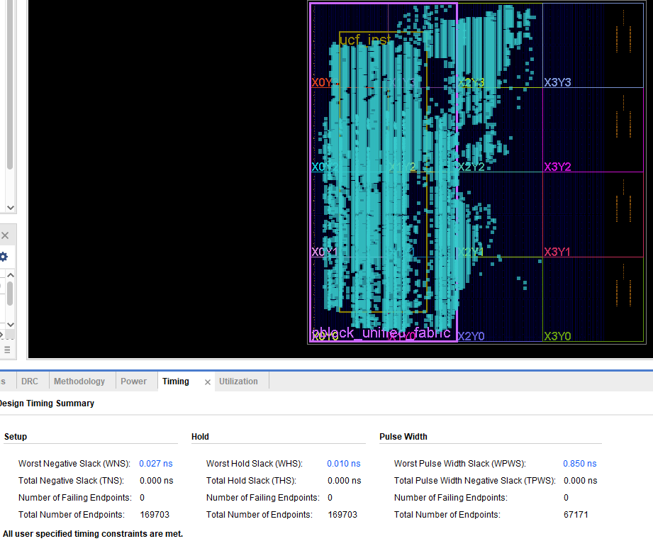
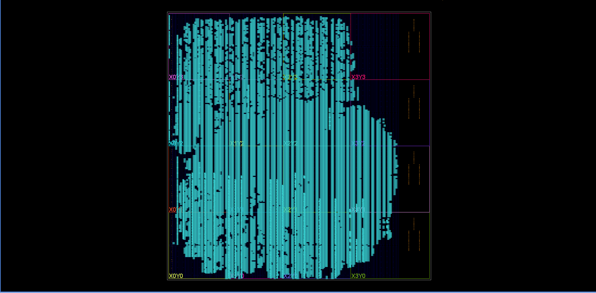
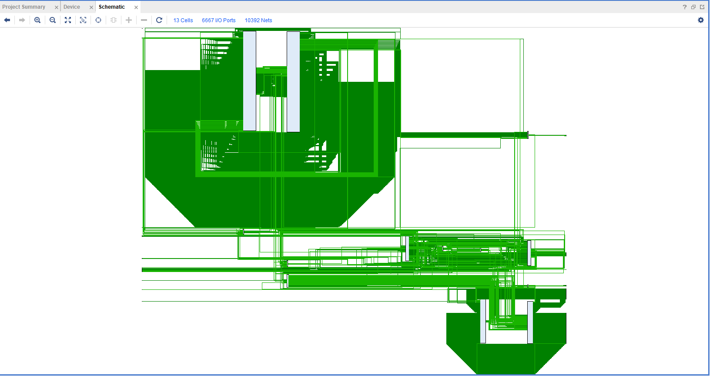
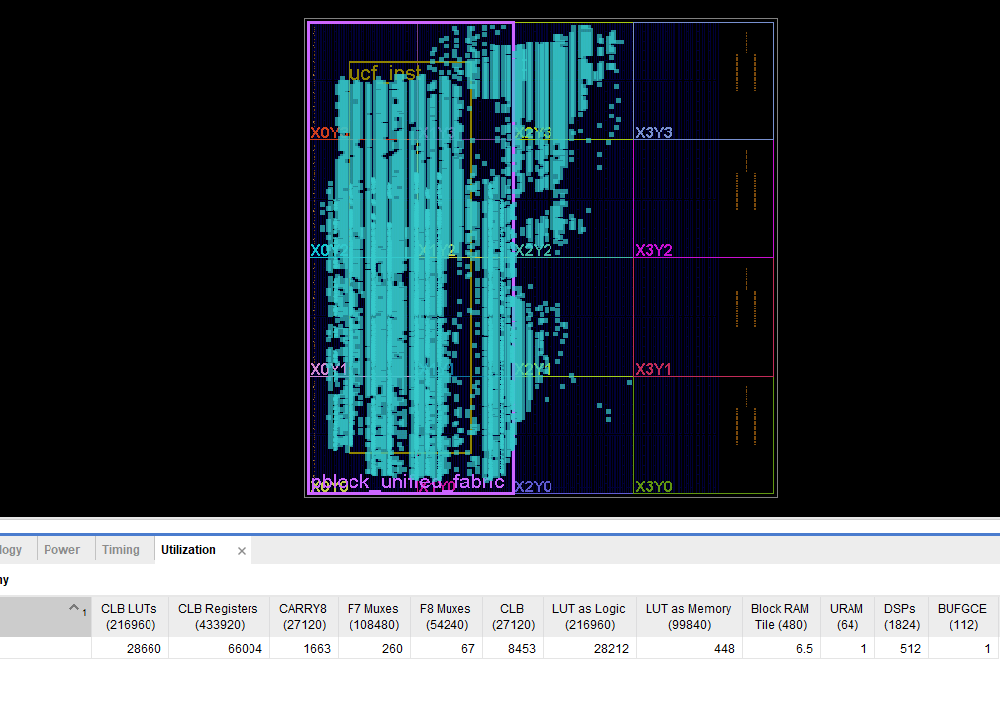
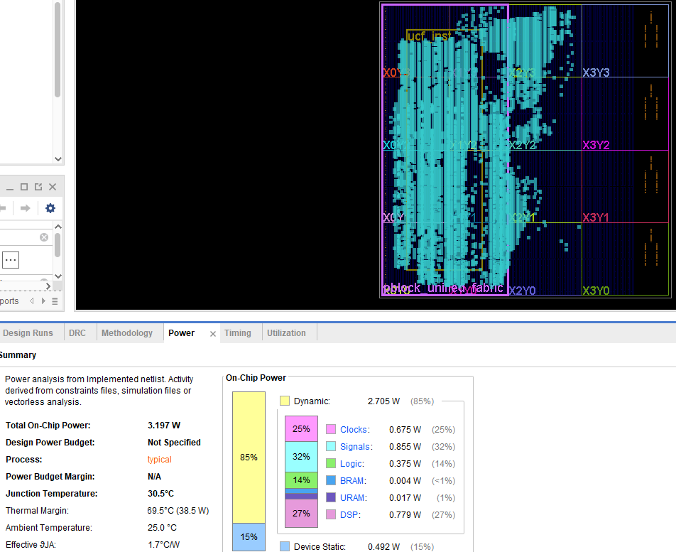
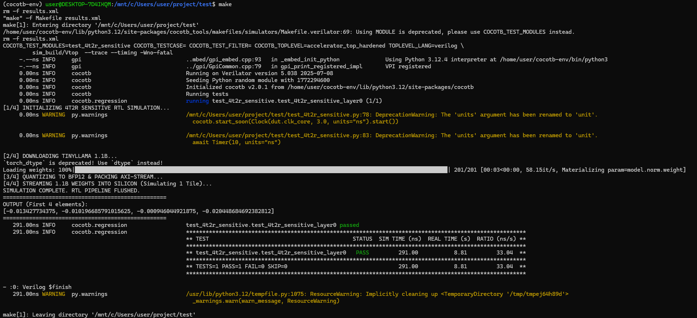
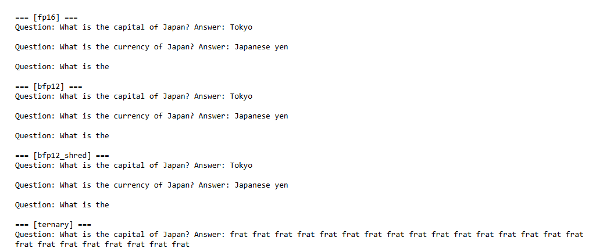

# 4T2R-SENSITIVE-Accelerator

A research-oriented accelerator for edge LLM inference built around a digital twin of a 4T2R ReRAM-based CIM fabric. This repository captures the RTL, verification flow, analytical model, and the experimental story behind the design.

## Why this project exists

Edge LLM serving is constrained by memory bandwidth, on-chip storage, and the cost of moving weights and activations. The architecture in this repository addresses that problem with a hybrid accelerator that mixes dense compute, sparse execution, memory staging, and a deterministic control plane. The design is meant to be read as a full SoC-level architecture story, not as a loose collection of RTL files.

## The architecture in depth

### 1. Dense core

The dense core is the main GEMM engine for the workload. It is implemented as a logically large $128 \times 128$ matrix-vector fabric, but it is mapped onto a smaller physical kernel through time-multiplexing rather than by instantiating a literal 16,384-PE spatial array on the FPGA. In this design, the logical array is partitioned into tiles, and the physical kernel reuses those tile resources over time.

Each processing element is a digital twin of a 4T2R ReRAM CIM cell. Instead of modeling a literal analog cell as a floating physical device, the RTL models the same mathematical behavior: a conductance-inspired multiply-and-accumulate primitive that can be calibrated and extended with noise hooks for future reliability studies. The arithmetic path uses BFP12-style values, with a shared exponent per block and a mantissa multiply-accumulate path that is fused into the PE pipeline.

The dense execution flow is weight-streaming and output-stationary:

1. A tile of weights is loaded into the physical PE fabric.
2. Activations are broadcast across the tile and consumed in lockstep.
3. Each group produces a partial result for a slice of the output columns.
4. Those partials flow into an array-level accumulator bank that holds the running sum for each output column until the full tile traversal completes.

This organization keeps the most expensive arithmetic localized inside the physical group while avoiding a costly global reduction tree. The result is a dense core that preserves the logical throughput of a larger systolic fabric while remaining practical on the target device.

### 2. Sparse core

The sparse core targets the parts of the workload that are naturally ternary or near-sparse. Its purpose is not to replace the dense core, but to provide an efficient path for sparse or low-precision operations that would otherwise waste dense datapath bandwidth. The sparse path uses a table-lookup matrix multiplication style mechanism with ternary weights.

Instead of using DSP-heavy multiply logic, the sparse core stores precomputed signed sum tables in LUTRAM or SRL-based structures. The weight pattern becomes the address, and the table emits the sum that would normally be produced by a sparse multiply. This makes the sparse core extremely lightweight and keeps its resource profile aligned with the project’s efficiency goals.

The sparse core is especially useful for FFN-style patterns and for tiles that are mostly zero or have very small dynamic range. The dense and sparse paths communicate through a dedicated streaming interface so the control plane can route work to the correct execution engine without forcing the dense core to absorb sparse-only traffic.

### 3. Memory system and staging

The memory subsystem is designed around URAM ping-pong staging and burst-friendly fill logic. Four URAM banks are used as a compute/fill pair for the dense path and another compute/fill pair for the sparse path, with an additional output staging structure to capture dense results before they are drained out to the system.

The memory manager performs three linked functions:

- It stages weights and activations into the correct ping-pong bank.
- It feeds the CSD engine so compressed data from DRAM is unpacked and converted on the way into URAM.
- It coordinates the dequantization boundary so quantized values can be converted into the BFP12 format needed by the dense core before compute begins.

The design also includes a BRAM-based KV cache and a shred controller that tracks tile usage and can demote or promote precision classes based on usage and error feedback. That allows the system to trade off storage pressure and compute fidelity without changing the outer execution contract.

### 4. Network routers and interconnect

The interconnect is a circuit-switched NoC rather than an AXI-style fabric. The routers are configured ahead of execution and then behave as deterministic mux-based paths for the duration of the transfer. This is a deliberate design choice: the dispatcher commits routes before data moves, so the network does not need to make dynamic arbitration decisions on a per-beat basis.

The NoC carries multicast traffic through destination masks. A multicast beat is accepted only when all selected destinations are ready, which preserves the hold-on-backpressure behavior expected by the streaming datapath. The routers are therefore simple, predictable, and aligned with the timing and area goals of the system. They are used to broadcast activations, fan out weight streams, and move partial outputs between the compute cores and the collectors.

### 5. Controllers and control plane

The system is governed by a macro-instruction dispatcher rather than by a generic host-driven state machine. The dispatcher decodes compact instructions, configures the relevant subsystems, and then issues the execution schedule. Before compute begins, it programs the NoC paths, selects the active ping-pong banks, and locks in tile traversal decisions so the datapath can run without per-beat control overhead.

The control plane is split into several cooperating blocks:

- The dispatcher issues macro-ops and maintains the execution schedule.
- The memory manager handles staging, fill, spill, and cache behavior.
- The shred controller tracks tile usage and drives precision policy.
- The drift-refresh controller schedules refresh activity and injects the AC stimulus into the digital-twin noise hooks.

This separation makes the architecture easier to verify and easier to reason about, because each subsystem has a clear contract and a narrow set of responsibilities.

## Key results

The project targets the edge-LLM frontier with a focus on throughput, latency, energy, and the ability to serve real model workloads.

- Peak dense-core throughput model: about 230 GOPS at the stated operating point
- Measured reload-bound corner: roughly 8.69 GOPS at the small-K reference point
- Power model: about 1.5 W for the accelerator core at the reported operating point
- Decode-oriented operating band: competitive token throughput with the shred-based compression strategy
- Research framing: the design is positioned as a full SoC-level contribution rather than as a raw analog macro comparison

## Timing and implementation view

The timing story is captured in the figure below. It highlights the critical-path structure, the clocking strategy, and the latency budget for the dense and sparse pipelines. The design intentionally keeps the compute clock and memory clock separate and routes all crossings through explicit CDC-safe interfaces rather than ad-hoc synchronizers.



## Visual overview

### System view



### Circuit and cell view



### Utilization view



### Power view



### Speed and throughput view



### Digital-twin and perplexity view



## Repository structure

```text
src/          # RTL, testbenches, constraints, scripts
 docs/        # research notes and design documents
 tools/       # analytics and modeling utilities
```

## Getting started

### Prerequisites

- Vivado 2025.2
- Xilinx UltraScale+ targeting flow
- Git

### Open the project

```bash
vivado project_1.xpr
```

### Explore the design

The RTL and verification flow live under the src tree. The supporting research and modeling material lives under docs and tools.

## License

This repository is provided as a research and prototyping codebase. Please review the licensing terms before using it in publications or broader distribution workflows.
